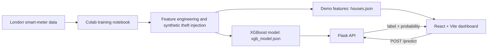

# DayInBits

AI-assisted household electricity-theft detection for identifying suspected **katiya** (meter-bypass) cases from smart-meter consumption features.

> DayInBits is an SIH 2026 software prototype. It combines an XGBoost classifier, a Flask prediction API, and a React monitoring dashboard. Current model results are based on synthetically injected theft patterns and must not be treated as field validation or proof of theft.

## What the project does

- Loads household-level smart-meter features from `houses.json`.
- Sends each household's seven features to a Flask `/predict` endpoint.
- Uses a trained XGBoost binary classifier to return a risk label and probability.
- Refreshes predictions every 20 seconds.
- Shows fleet totals, suspected cases, a confidence chart, filters, search, sorting, and expandable household details.
- Supports light and dark dashboard themes.

## System architecture



## Repository structure

```text
SIH2026/
|-- dayInBits-API/
|   |-- app.py                  # Flask API and prediction endpoint
|   |-- xgb_model.json          # Trained XGBoost model
|   `-- features_gap.pkl        # Legacy/unused serialized artifact
|-- dayInBits-DASHBOARD/
|   |-- dayinbits-dashboard/    # Actual Vite application
|   |   |-- public/houses.json  # 99 demo household feature rows
|   |   |-- src/App.jsx         # Dashboard and API integration
|   |   |-- src/index.css       # Tailwind theme and animations
|   |   `-- package.json
|   |-- package.json            # Legacy outer package manifest
|   `-- package-lock.json
`-- dayinbits_week1_1.ipynb     # Data preparation and model experiments
```

## Model and data

The notebook uses the public **Smart Meters in London** dataset referenced in the project as `jeanmidev/smart-meters-in-london` (ODbL-1.0). It reads three half-hourly data blocks, filters households with more than 20,000 readings, aggregates daily energy use, and builds a 99-household demo feature table.

The final experiment randomly marks 20 households as synthetic theft cases. Their metered consumption is reduced by 60-95%, while 2% zero-reading noise is added to normal households. The deployed model is an XGBoost gradient-boosted tree classifier with 200 estimators, maximum depth 4, and learning rate 0.1.

### Input features

| Feature | Meaning |
|---|---|
| `avg_metered` | Mean metered daily consumption |
| `std_metered` | Standard deviation of metered consumption |
| `max_metered` | Maximum metered daily consumption |
| `min_metered` | Minimum metered daily consumption |
| `avg_actual` | Mean simulated actual consumption |
| `theft_ratio` | Estimated unmetered share: `1 - avg_metered / avg_actual` |
| `zero_day_ratio` | Fraction of days with a zero meter reading |

### Notebook evaluation

The final notebook uses a stratified 70/30 split. On the 30-household test split (24 normal and 6 synthetic theft cases), it records:

| Metric | Result |
|---|---:|
| Accuracy | 96.7% (29/30) |
| Theft precision | 100% |
| Theft recall | 83% (5/6) |
| Theft F1 score | 91% |
| False positives | 0 |
| False negatives | 1 |

These values come from a small synthetic experiment. A production claim requires independent, real utility data, temporal validation, calibration, and pilot testing.

## Prerequisites

- Node.js `^20.19.0` or `>=22.12.0` (required by Vite 8)
- Python 3.10-3.12 recommended
- npm

## Quick start

### 1. Start the prediction API

Run the API from its own directory because the model path is currently relative.

```bash
cd dayInBits-API
python -m venv .venv
```

Activate the environment:

```powershell
# Windows PowerShell
.\.venv\Scripts\Activate.ps1
```

```bash
# macOS/Linux
source .venv/bin/activate
```

Install the runtime packages and start Flask:

```bash
python -m pip install Flask Flask-Cors pandas scikit-learn xgboost==3.4.1
python app.py
```

The API should be available at `http://127.0.0.1:5000`.

### 2. Start the dashboard

Open a second terminal:

```bash
cd dayInBits-DASHBOARD/dayinbits-dashboard
npm ci
npm run dev
```

Open the URL printed by Vite, normally `http://127.0.0.1:5173`.

## API reference

### Health check

```http
GET /
```

```json
{"status":"DayInBits API is running"}
```

### Predict one household

```http
POST /predict
Content-Type: application/json
```

```json
{
  "avg_metered": 1.2984,
  "std_metered": 0.4835,
  "max_metered": 4.2256,
  "min_metered": 0.0200,
  "avg_actual": 4.8283,
  "theft_ratio": 0.7311,
  "zero_day_ratio": 0.0
}
```

Example response:

```json
{
  "is_katiya": 1,
  "theft_probability": 0.927
}
```

`is_katiya: 1` means the model flags the household for review; it is not conclusive evidence of theft.

## Development commands

Run these commands inside `dayInBits-DASHBOARD/dayinbits-dashboard`:

```bash
npm run dev      # development server
npm run build    # production bundle
npm run preview  # preview the production bundle
npm run lint     # Oxlint checks
```

The current frontend builds successfully. The linter reports non-blocking warnings around `Date.now()` during render and synchronous state updates in an effect. The CSS optimizer also warns that the Google Fonts `@import` should precede the Tailwind import.

## Current limitations

- **Synthetic ground truth:** the 20 positive cases are simulated, not confirmed field incidents.
- **Potentially unavailable signal:** `avg_actual` and therefore `theft_ratio` rely on actual consumption known before tampering in the notebook. A field deployment needs feeder-level reconciliation, an independent sensor, or a defensible household baseline estimator.
- **Small evaluation:** the test set contains only 30 households and no temporal or cross-utility holdout.
- **Hard-coded API address:** the dashboard calls `http://127.0.0.1:5000`; use an environment variable before deployment.
- **No batch prediction:** the UI makes 99 concurrent requests every 20 seconds. A batch endpoint would be more efficient.
- **Limited resilience:** frontend API errors, timeouts, and partial failures are not yet surfaced to users.
- **API hardening required:** request validation, authentication, rate limiting, structured logging, and production WSGI hosting are not implemented.
- **Prototype artifacts:** `features_gap.pkl`, `App.css`, and the outer dashboard package manifest are currently unused or redundant.
- **Metric wording:** the UI states 97.2% accuracy, while the final notebook result is 29/30 = 96.7% (displayed as 0.97 by the report).

## Recommended next steps

1. Define how household "actual" usage will be estimated in the field.
2. Collect consented pilot data with investigation-confirmed outcomes.
3. Add temporal validation, cross-validation, calibration, and threshold tuning.
4. Add a batch prediction endpoint and environment-based configuration.
5. Add schema validation, API tests, frontend tests, monitoring, and model-version metadata.
6. Present every alert as a review priority, with human verification before enforcement.

## Data and licensing notes

- The notebook identifies the source dataset as Smart Meters in London under ODbL-1.0. Review its attribution and share-alike obligations before redistributing derived data.
- The repository currently contains no project-level software license. Add an explicit license before inviting reuse or external contributions.

